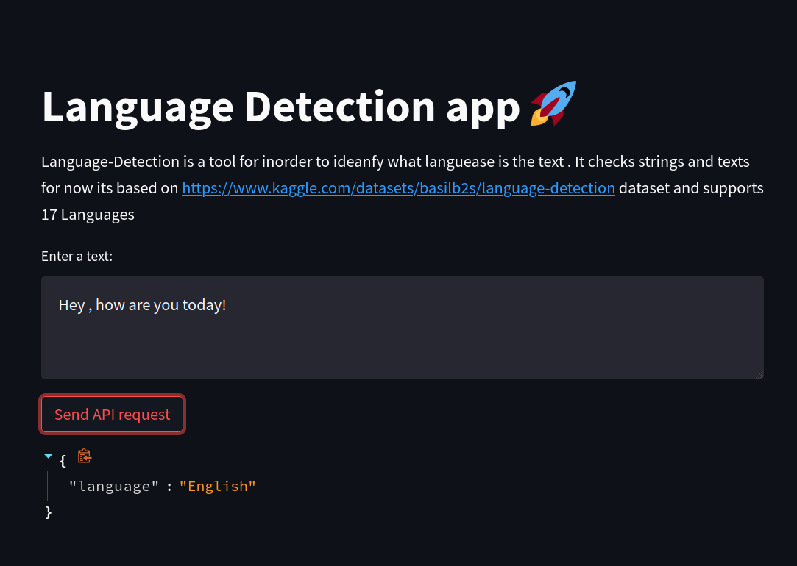
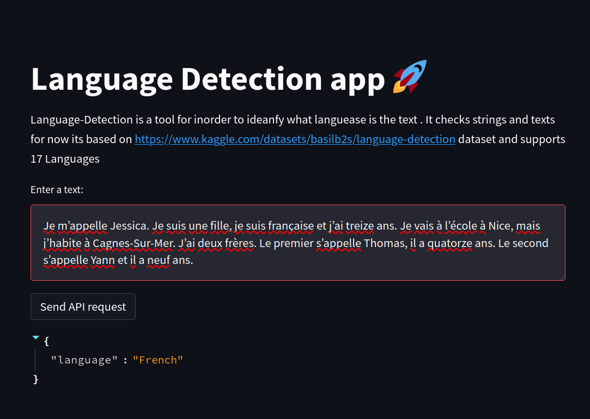

# Language Detection App 

This is a language detection application that uses a machine learning model to predict the language of a given text.
The app has a backend implemented with FastAPI and a frontend built with Streamlit. The application also includes
a PostgreSQL database for logging the text inputs and their corresponding language predictions made by the frontend.
it based on: 
https://www.kaggle.com/datasets/basilb2s/language-detection dataset
and supports 17 Languages
* English
* Malayalam
* Hindi
* Tamil
* Kannada
* French
* Spanish
* Portuguese
* Italian
* Russian
* Swedish
* Dutch
* Arabic
* Turkish
* German
* Danish
* Greek

# Prerequisites
Before you begin, make sure you have the following installed on your machine:
  *  Docker and Docker Compose
  *  Python 3.9 or later

# Running the App
1. Clone the repository to your local machine:
```
git clone https://github.com/EASS-HIT-PART-A-2022-CLASS-II/Language-Detection.git
```
2. Navigate to the repository directory:
```
cd LanguageDetection
```
3. Navigate to the production branch:
```
git checkout production
```
4. Build and start the containers:
```
docker-compose up --build
```
5. Access the Streamlit frontend in your browser at http://localhost:8501
6. inorder to stop the app:
```
docker-compose down
```


# Backend (FastAPI)
The backend is responsible for serving the machine learning model for language prediction. It uses FastAPI for
API development and the requests library to make predictions. The backend is defined in the BackEnd directory and
listens on port 80.

# Frontend (Streamlit)
The frontend allows users to input text and see the corresponding language prediction made by the machine learning
model. It uses Streamlit for building the interface and makes API calls to the backend to get predictions.
The frontend is defined in the FrontEnd directory and listens on port 8501.

# Database (PostgreSQL)
The database stores the text inputs and the corresponding language predictions made by the frontend. The database is
built from the Database directory and listens on port 5432.

# File Structure
```
 .
├── BackEnd
│   ├── app
│   │   ├── main.py
│   │   ├── ML_model
│   │   │   ├── model.py
│   │   │   ├── __pycache__
│   │   │   │   ├── model.cpython-310.pyc
│   │   │   │   ├── model.cpython-310-pytest-7.2.0.pyc
│   │   │   │   └── test_model_comp.cpython-310-pytest-7.2.0.pyc
│   │   │   └── trained_pipeline-0.5.0.pkl
│   │   ├── __pycache__
│   │   │   ├── main.cpython-310-pytest-7.2.0.pyc
│   │   │   └── test_app_backend.cpython-310-pytest-7.2.0.pyc
│   │   └── test_app_backend.py
│   ├── Dockerfile
│   └── requirements.txt
├── Database
│   ├── Dockerfile
│   └── init.sql
├── docker-compose.yml
├── FrontEnd
│   ├── app.py
│   ├── Dockerfile
│   ├── __pycache__
│   │   └── test_front_end.cpython-310-pytest-7.2.0.pyc
│   ├── requirements.txt
│   └── test_front_end.py
├── LICENSE
├── Model_Code
│   ├── Language-Detection.ipynb
│   ├── __pycache__
│   │   └── test_ld.cpython-310-pytest-7.2.0.pyc
│   ├── test_ld.py
│   └── trained_pipeline-0.5.0.pkl
├── README.md
└── Tools
    ├── img_1.png
    ├── img_2.png
    └── img.png

11 directories, 28 files
```
# How to Test
just enter the following statement in the root directory:
```
pytest
```
# Revamped User Interface

# Additional Example Screenshots

# Project Roadmap:
- [x] Develop backend using FASTAPI
- [x] Integrate machine learning model into FASTAPI
- [x] Create Dockerfile for backend
- [x] Develop frontend using Streamlit
- [x] Create Dockerfile for frontend
- [x] Connect frontend and backend
- [x] Add PostgresSQL database service
- [x] Add Docker Compose configuration file
- [x] Add tests

# Acknowledgements
1. **FastAPI**
2. **Streamlit**
3. **PostgresSQL**

# License
This project is licensed under the MIT License.

# Additional Information
The development of this project was initiated for the EASS-HIT-PART-A-2022-CLASS-II course by Eden Sheiko