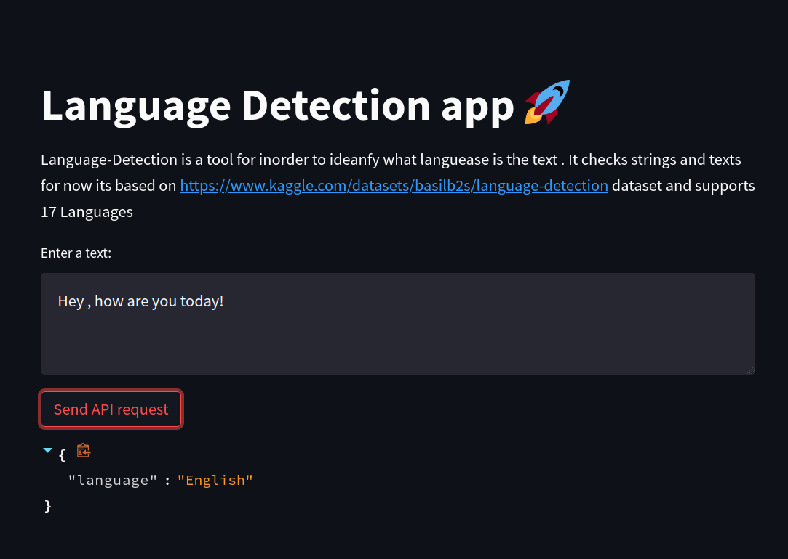
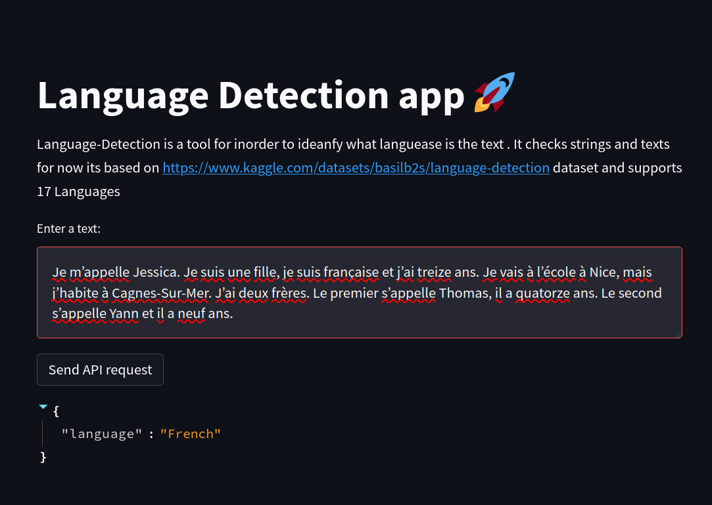

# Language-Detection  

Language-Detection is a tool for inorder to ideanfy what languease is the text . It checks strings and texts
for now its based on 
https://www.kaggle.com/datasets/basilb2s/language-detection dataset
and supports 17 Languages
* 1) English
* 2) Malayalam
* 3) Hindi
* 4) Tamil
* 5) Kannada
* 6) French
* 7) Spanish
* 8) Portuguese
* 9) Italian
* 10) Russian
* 11) Sweedish
* 12) Dutch
* 13) Arabic
* 14) Turkish
* 15) German
* 16) Danish
* 17) Greek

# How to use
go to the next url:
https://fastapi-test-backend.herokuapp.com/predict

send a json with the following format:
inorder to get prediction for the input

# ui update 

# more examples

# future plans:
* 1) to add ui to the app.
* 2) make the ui work also on the deployment


# how to deploy
 deployment:
```
docker build -t [enter some name to the file]
docker run -p  80:80 [the previous name]
```
